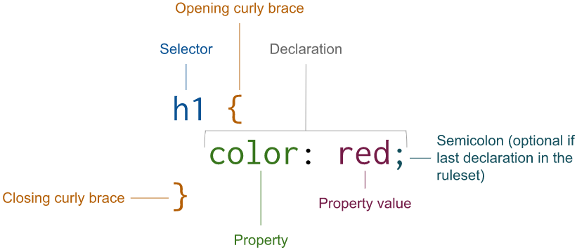
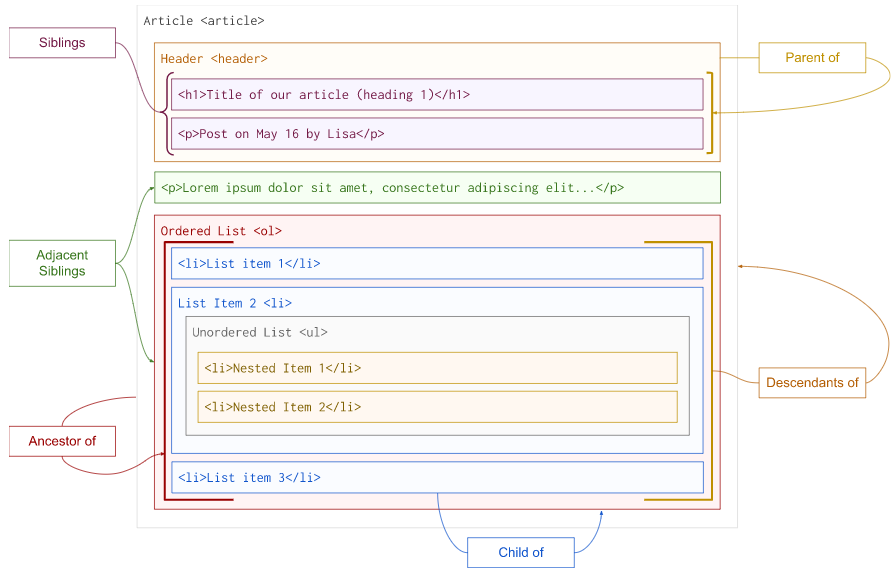
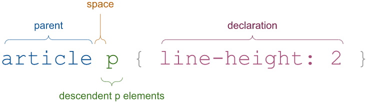
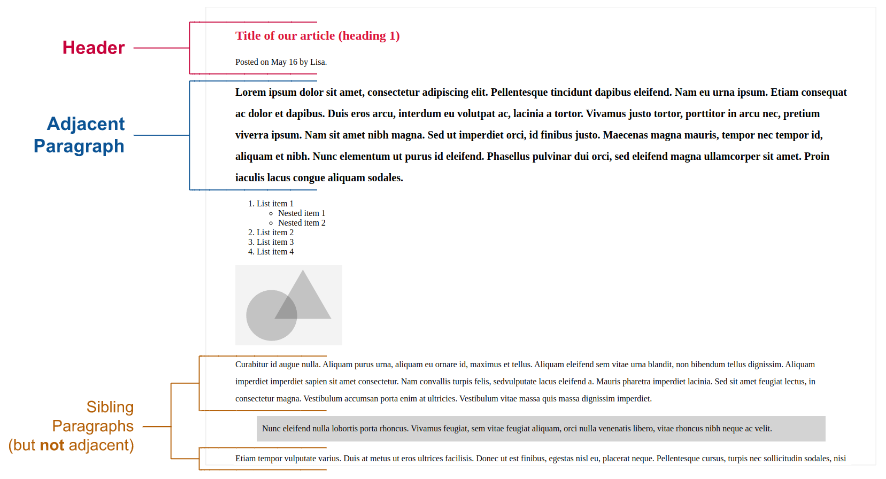
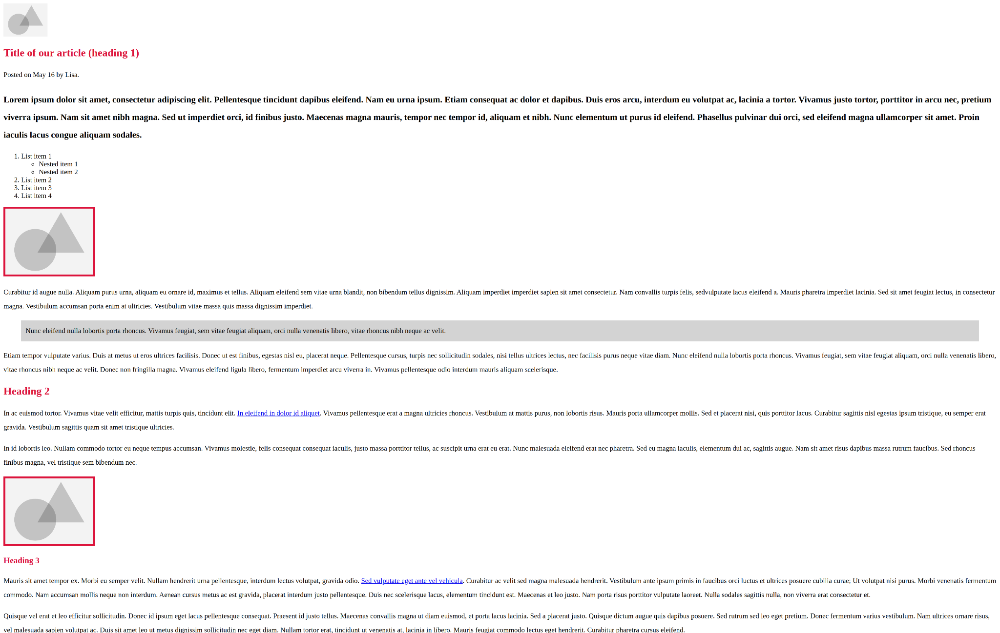

# Ch01 CSS introduction


> This chapter covers:
>
> - A brief overview of CSS
> - Basic CSS styling
> - Selecting HTML elements effectively


- in 1994: *Håkon Wium Lie* first proposed the idea of `CSS`
- in 1990: *Tim Berners-Lee* created `HTML`


benefits of keeping good `SoC` (**S**eparation **o**f **C**oncerns):

- Decreased code duplication
- Extendability
- Stability


> The difference between **responsive** and **adaptive** designs:
>
> - **responsive** designs: uses a single fluid layout
> - **adaptive** designs: create multiple fixed layouts giving us greater control over each one


> **3 releases of CSS**
>
> 1. 1996 - World Wide Web Consortium (W3C) recommendation of CSS Level 1
> 2. 1997 - First working draft of CSS Level 2
> 3. 1999 - First three CSS3 drafts (color profiles, multi-column layouts and paged media)
>    （颜色配置文件、多列布局和页面媒体）


> **What is CSS?**
>
> - a **declarative** programming language: tells the browser **what needs to be done** rather than **how to do** it
> - a **domain-specific** language (DSL): generally *less complex* than **G**eneral **P**urpose **L**anguages (**GPL**) like `Java` or `C#`.
> - CSS’s specific purpose: is to **style web content** (similar to `SQL`, `HTML`, `XPath` etc.)


> ***CSS preprocessors***
>
> `SASS`: **S**yntactically **A**wesome **S**tyle **S**heet（语法很棒的样式表）


Code editor recommended:

- [Sublime](https://www.sublimetext.com/)
- [Brackets](https://brackets.io/)
- [Visual Studio Code](https://code.visualstudio.com/)


Basic text editor as an alternative:

- `TextEdit` for Mac: https://support.apple.com/guide/textedit/welcome/mac
- `Notepad` for Windows: https://apps.microsoft.com/store/detail/windows-notepad/9MSMLRH6LZF3
- `Gedit` for Linux: https://wiki.gnome.org/Apps/Gedit


Online development editor: [CodePen](https://codepen.io/)


## 1.3 Adding CSS to our HTML

three ways to apply CSS to our HTML:

1. Inline: `style` attribute
2. Embedded: `style` element (tag)
3. External: `<link>` tag & `.css` file


### 1 Inline  way

```html
<h1 style="color: crimson"> Title of our article (heading 1)</h1>
```

PROs: page load performance

CONs: it can quickly become **unmanageable**:

1. it takes the highest **specificity** in CSS
2. concerns are no longer separated
3. repeating the same code in a large number of places


### 2 Embedded CSS

```html
<style>
    h1, h2, h3, h4, h5, h6 {
        color: crimson;
    }
</style>
```

benefit: grouping all of our CSS together to the whole HTML document

ruleset composition:



Note:

1. To apply multiple selectors, use a comma as dilimeter;
2. Both properties and values must be written in **American English**: `colour` or `capitalise` are not supported;

PROs: 

1. works well for **one-off** web pages（一次性网页、只需设置一次样式的页面）;
2. groups CSS nicely;
3. page load performance (better than external solution);

CONs: 

- the CSS will only work for that document


3 External CSS

index.html:

```html
<head>
    <link rel="stylesheet" href=“styles.css">
</head>
```

styles.css:

```css
h1,h2,h3,h4,h5,h6 {
  color: crimson;
}
```

main advantage: effectively **separate our concerns**: content and style

PROs:

- CSS is in one single document which can be modified once and whose changes will apply across all of our HTML pages

CONs:

- it will take an extra request from the browser to retrieve that document


## 1.4 The cascade of cascading style sheets

> **specificity**（优先级）
>
> Specificity is when the browser (or the user-agent) decides which declarations are relevant to the HTML and applies the styling to that element.
>
> Assuming the same selector is used, the last one declared wins.

> **3 different stylesheet origins**
>
> 1. User-agent style sheets：浏览器默认样式
> 2. Author stylesheets：开发人员编写的页面样式
> 3. User stylesheets：用户自定义样式，常通过浏览器设置、第三方插件设置


### 1 CSS reset

apply a CSS reset: reference a CSS file name `reset.css`:

```css
/* http://meyerweb.com/eric/tools/css/reset/ 
   v2.0 | 20110126
   License: none (public domain)
*/

html, body, div, span, applet, object, iframe,
h1, h2, h3, h4, h5, h6, p, blockquote, pre,
a, abbr, acronym, address, big, cite, code,
del, dfn, em, img, ins, kbd, q, s, samp,
small, strike, strong, sub, sup, tt, var,
b, u, i, center,
dl, dt, dd, ol, ul, li,
fieldset, form, label, legend,
table, caption, tbody, tfoot, thead, tr, th, td,
article, aside, canvas, details, embed, 
figure, figcaption, footer, header, hgroup, 
menu, nav, output, ruby, section, summary,
time, mark, audio, video {
	margin: 0;
	padding: 0;
	border: 0;
	font-size: 100%;
	font: inherit;
	vertical-align: baseline;
}
/* HTML5 display-role reset for older browsers */
article, aside, details, figcaption, figure, 
footer, header, hgroup, menu, nav, section {
	display: block;
}
body {
	line-height: 1;
}
ol, ul {
	list-style: none;
}
blockquote, q {
	quotes: none;
}
blockquote:before, blockquote:after,
q:before, q:after {
	content: '';
	content: none;
}
table {
	border-collapse: collapse;
	border-spacing: 0;
}
```

Reference it before `styles.css`：

```html
<head>
    <link rel="stylesheet" href="reset.css">
    <link rel="stylesheet" href="styles.css">
</head>
```


### 2 CSS Normalize

Reference a CSS file named `normalize.css` as `reset.css` does. Its content can be found here: https://github.com/necolas/normalize.css/


Specificity value calculation:

- 100 - ID selectors
- 10 - Class selectors, attribute selectors, and pseudo-classes
- 1 - Type selectors, and pseudo elements
- 0 - Universal selectors


## 1.6 CSS selectors

### 1.6.1 Basic selectors

#### 1 Type selector

```css
h1, h2, h3, h4, h5, h6 { color: crimson; }
```


#### 2 Class selectors

关于样式类命名的方法论：

1. Block，Element，Modifier（[BEM](https://en.bem.info/)）；
2. Scalable and Modular Architecture for CSS（[SMACSS](http://smacss.com/)）

两个误区：

1. 类名含义模糊：如 `text`，存在指代不明的问题。
2. 类名为颜色名：也可能有风险。例如，类名为 `blue`，后期对应的颜色调整为红色，这样的类名就没有任何意义了。


设置 `small-heading` 类按大写字母显示：

```css
.small-heading { text-transform: uppercase; }
```


#### 3 ID Selector

HTML 中的 ID 应该是唯一的。若重复多次，这样的代码会被视为无效的 HTML。

Unless the uniqueness of the element is key, ID attributes should be avoided.（除非元素的唯一性是 `key` 键，否则应避免使用 `ID` 属性）

练习：设置 ID 值为 `quote-by-author` 的元素样式，设为引文：

```css
#quote-by-author {
    background: lightgrey;
    padding: 10px;
	line-height: 1.75;
}
```


### 1.6.2 Combinators

There are four combinators:

1. Descendant combinator (`space`)
2. Child combinator (`>`)
3. Adjacent sibling combinator (`+`)
4. General sibling combinator (`~`)

relationships:




#### 4 Descendant combinator (`space`)

后代型组合式选择器




#### 5 Child combinator (`>`)

直接子级型组合式选择器

to target the **immediate children** elements of a particular selector

```css
.list > li { color: crimson;}
```

to select the **parent** or **ancestor** of an element, use the `has()` pseudo class

例如，若要反向选中包含 `p` 标签的 `article` 标签，应使用：`article:has(p)`

```css
article:has(p) { color: blue; }
```


#### 6 Adjacent sibling combinator (`+`)

相邻型组合式选择器

If we want to target the element that is **directly after another** we can use a selector that uses an adjacent sibling combinator.

```css
header + p {
  font-size: 1.25rem;
  font-weight: bold;
}
```



用途：

1. 新闻报纸：突出第一段内容；
2. 表单错误的处理：在表单某控件的无效值后面，立即显示错误信息。


#### 7 General sibling combinator (`~`)

used to target all elements that are **siblings after** the element targeted by the selector.

style all the sibling images that come after the element `header`.

```css
header ~ img { border: 4px solid crimson; }
```

The browser will find the `header` element, and target all the sibling images (`img`) **after that element**




### 1.6.3 Pseudo-class and pseudo-element selectors

#### 1 Pseudo-class

The most common link states are:

- `link`: an anchor tag (`<a>`) that contains an `href` attribute and a url that is **not found** in the user’s browser history
- `visited`: an anchor (`<a>`) element that contains an `href` attribute, and a url that is **found** in the user’s browser history
- `hover`: the user has their cursor **over the link, but has not pressed** it
- `active`: the user is clicking the link and **holding the click down**
- `focus`: a focused element is an element that will receive keyboard events by default. When a user clicks on an element it automatically gains focus (unless there is JavaScript altering this behavior). Using the keyboard to navigate between form fields, links, and buttons will also change the element that is in focus.
- `focus-within`: is applied to a parent element. If a child of the parent has focus, focus-within styles will be applied.
- `focus-visible`: applies only when the focus has been gained via keyboard navigation or the user is interacting with the element via the keyboard.

最后两个不常见。

上一节提到的 `:has()` 也是一个伪类，用于选中其后代元素中 **至少含有一个** 括号内指定元素的 **父元素**（it applies when the element has at least one descendent that meets the selector specified inside of the parentheses）


> **Chrome's devtool**
>
> use `:hov` to test pseudo-classes elems


