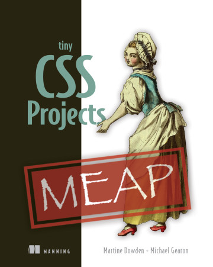

# 《Tiny CSS Projects》Learning Notes


## 1. Profiles




|    **Title**    | **Tiny CSS Projects** [ISBN: 9781633439832] |
| :-------------: | :-----------------------------------------: |
|   **Author**    |    **Michael Gearon and Martine Dowden**    |
| **Publication** |          **Manning, 2023 summer**           |
|    **Pages**    |                   **426**                   |

> **Introduction**
>
> **CSS is a must-know tool for all web developers. In this practical book, you’ll explore numerous techniques to improve the way you write CSS as you build 12 tiny projects.**
>
> In *Tiny CSS Projects* you'll build twelve exciting and useful web projects including:
>
> 
>
> - A loading screen created by styling SVG graphics
> - A responsive newspaper layout with multi-columns
> - Animating social media buttons with pseudo-elements
> - Designing layouts using CSS grids
> - Summary cards that utilize hover interactions
> - Styling forms to make them more appealing to your users
>
> The projects may be tiny, but the CSS skills you'll learn are huge! *Tiny CSS Projects* teaches you how to make beautiful websites and applications by gilding you through a dozen fun coding challenges. You'll learn important skills through hands-on practice as you tinker with your own code and make real creative decisions about the projects you’re building. You'll rapidly master the basics and then press on into CSS’s exciting layout features including grid and flexbox, animations, transitions, and media queries.
>
> **about the technology**
>
> Cascading Style Sheets (CSS) make the web beautiful. Where HTML structures a page and JavaScript gives it additional functionality, CSS handles colors, layouts, and typography—everything that your users love about your site. While CSS is an established tool used in almost all production websites, it’s also evolving to include new features.
>
> **about the book**
>
> *Tiny CSS Projects* develops your CSS skills through 12 delightfully creative mini-projects. Each project sets you up with a premade HTML skeleton for you to use as a foundation for your work. You’ll build up your portfolio of common and useful web designs, including a loading screen, an eCommerce checkout, and animated social media buttons. As you tackle each tiny project, you'll learn about animation, transitions, layout, styling forms, and even typography. All the skills you master are easy to transfer to full-size applications!


## 2. Outlines

Status available：:heavy_check_mark: (Completed) | :hourglass_flowing_sand: (Working) | :no_entry: (Not Started) | :orange_book: (Finish reading)

| No.  |                       Chapter Title                        |          Status          |
| :--: | :--------------------------------------------------------: | :----------------------: |
| Ch01 |               [CSS introduction](./Ch01.md)                | :hourglass_flowing_sand: |
| Ch02 |      [Designing a layout using CSS grids](./Ch02.md)       |        :no_entry:        |
| Ch03 | [Creating a responsive animated loading screen](./Ch03.md) |        :no_entry:        |
| Ch04 |  [Creating a responsive web newspaper layout](./Ch04.md)   |        :no_entry:        |
| Ch05 |     [Summary cards with hover interactions](./Ch05.md)     |        :no_entry:        |
| Ch06 |            [Creating a profile card](./Ch06.md)            |        :no_entry:        |
| Ch07 |      [Harnessing the full power of float](./Ch07.md)       |        :no_entry:        |
| Ch08 |           [Designing a checkout cart](./Ch08.md)           |        :no_entry:        |
| Ch09 |        [Creating a virtual credit card](./Ch09.md)         |        :no_entry:        |
| Ch10 |                 [Styling forms](./Ch10.md)                 |        :no_entry:        |
| Ch11 |       [Animated social media share links](./Ch11.md)       |        :no_entry:        |
| Ch12 |              [Using preprocessors](./Ch12.md)              |        :no_entry:        |


Powershell script for generating markdown files in batch:

```powershell
# Create 12 empty markdown files named Ch##.md:
for($i=1; $i -le 12; $i=$i+1){ New-Item -Name "Ch$('{0:d2}' -f $i).md"; }
```

 
